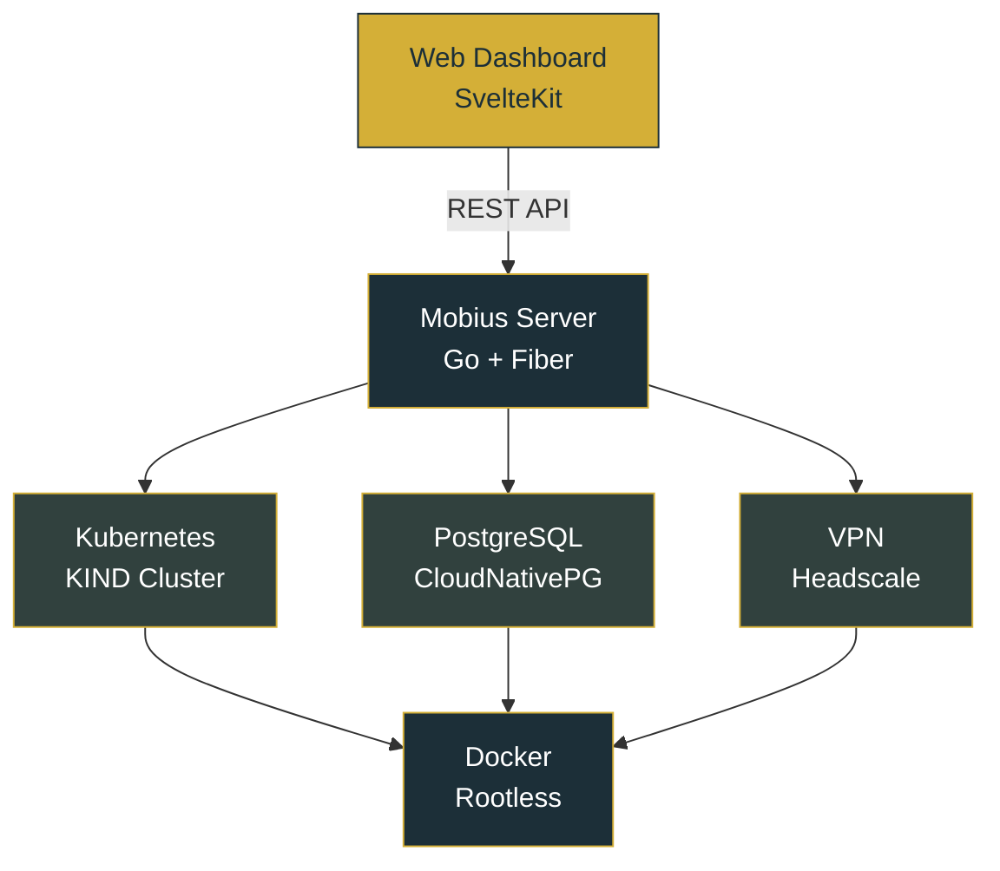

<div align="center">


# Mobius

**Container Orchestration & MDM Platform**

A unified platform for managing Kubernetes clusters, PostgreSQL databases, and VPN mesh networks through a modern web interface.

[Quick Start](#quick-start) • [Documentation](docs/) • [API Reference](DEPLOYMENT.md#api-reference)

</div>

---

## What is Mobius?

Mobius is a cross-platform device management (MDM) solution for managing and monitoring devices across multiple operating systems.

**Key Capabilities:**

- **Device Enrollment** - Onboard macOS, Windows, and Linux devices with secure enrollment keys
- **Remote Management** - Monitor device health, run queries, and manage configurations remotely
- **Policy Enforcement** - Organize devices into groups and apply policies consistently
- **Real-time Monitoring** - Track device status, connectivity, and system information via OSQuery
- **Centralized Dashboard** - Manage your entire device fleet from a unified web interface

Mobius uses Kubernetes, PostgreSQL, and VPN mesh networking as its infrastructure foundation, providing a scalable and secure platform for enterprise device management



## Quick Start

### Prerequisites

- Linux system with sudo access
- Go 1.21+ and Node.js 20+
- 4GB+ RAM available

### Installation

```bash
# Clone and build
git clone https://github.com/MobiusDM/Mobius.git
cd Mobius
go build -o mobius-server cmd/server/main.go

# Run deployment
./mobius-server
```

The server will automatically:

1. Start an isolated Docker daemon
2. Create a Kubernetes cluster
3. Deploy PostgreSQL and Headscale operators
4. Launch the REST API on port 3001
5. Build and deploy the web dashboard on port 3000

### Access

- **Dashboard**: <http://localhost:3000>
- **API**: <http://localhost:3001>

### Headless Mode

For running the server as a background daemon or in environments without a terminal:

```bash
./mobius-server --headless
# or
./mobius-server --no-tui
```

## Architecture

Mobius runs an isolated, rootless Docker environment with a Kubernetes cluster managed by KIND. All services are deployed as Kubernetes workloads and exposed through a unified REST API.

**Core Components:**

- **Backend**: Go with Fiber web framework
- **Frontend**: SvelteKit with TypeScript and Tailwind CSS
- **Container Runtime**: Docker (rootless with VFS storage)
- **Orchestration**: KIND (Kubernetes in Docker)
- **Database Operator**: CloudNativePG
- **VPN**: Headscale (Tailscale-compatible)

## Documentation

- [Deployment Guide](DEPLOYMENT.md) - Complete setup and troubleshooting
- [Quick Start Guide](QUICKSTART.md) - Basic installation
- [Web Dashboard](web/README.md) - Frontend architecture
- [Branding Guidelines](pkg/branding/README.md) - Design system
- [Technical Docs](docs/) - Additional documentation

## License

[Add license information]

---

<div align="center">
Built with Go, SvelteKit, and Kubernetes
</div>
