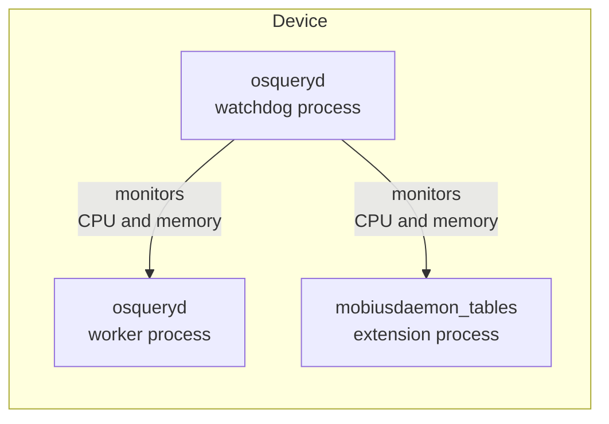

# Load test of osquery queries in macOS and Windows

Following are the steps to load test osquery on macOS, Windows and Linux.
The purpose is to know the impact of Mobius provided queries on real devices.

> The scripts that process osquery logs were written and tested on macOS.

## Requirements

- Osquery [v5.10.2](https://github.com/osquery/osquery/releases/tag/5.10.2) (the `--enable_watchdog_debug` flag was added on v5.10.2).
- Install gnuplot and ripgrep, e.g. on macOS:

```sh
brew install gnuplot ripgrep
```

## Architecture

We are going to use the [mobiusdaemon tables](../../../orbit/cmd/mobiusdaemon_tables/README.md) as an extension so that it is also monitored by the watchdog.



## macOS

### Build mobiusdaemon_tables extension

```sh
make mobiusdaemon-tables-darwin-universal
sudo cp mobiusdaemon_tables_darwin_universal.ext /usr/local/osquery_extensions/mobiusdaemon_tables.ext
echo "/usr/local/osquery_extensions/mobiusdaemon_tables.ext" > /tmp/extensions.load
```

### Run osquery

> The following assumes a Mobius server instance running and listening at `localhost:8080`.

```sh
mkdir -p /Users/luk/osqueryd/osquery_log
```

```sh
sudo ENROLL_SECRET=<...> ./osquery/osqueryd \
    --verbose=true \
    --tls_dump=true \
    --pidfile=/Users/luk/osqueryd/osquery.pid \
    --database_path=/Users/luk/osqueryd/osquery.db \
    --logger_path=/Users/luk/osqueryd/osquery_log \
    --host_identifier=instance \
    # /Users/luk/mobiusmdm/git/mobius is the location of the Mobius mono repository.
    --tls_server_certs=/Users/luk/mobiusmdm/git/mobius/tools/osquery/mobius.crt \
    --enroll_secret_env=ENROLL_SECRET \
    --tls_hostname=localhost:8080 \
    --enroll_tls_endpoint=/api/v1/osquery/enroll \
    --config_plugin=tls \
    --config_tls_endpoint=/api/v1/osquery/config \
    --config_refresh=60 \
    --disable_distributed=false \
    --distributed_plugin=tls \
    --distributed_tls_max_attempts=10 \
    --distributed_tls_read_endpoint=/api/v1/osquery/distributed/read \
    --distributed_tls_write_endpoint=/api/v1/osquery/distributed/write \
    --logger_plugin=tls,filesystem \
    --logger_tls_endpoint=/api/v1/osquery/log \
    --disable_carver=false \
    --carver_disable_function=false \
    --carver_start_endpoint=/api/v1/osquery/carve/begin \
    --carver_continue_endpoint=/api/v1/osquery/carve/block \
    --carver_block_size=2000000 \
    --extensions_autoload=/tmp/extensions.load \
    --allow_unsafe \
    --enable_watchdog_debug \
    --distributed_denylist_duration 0 \
    --enable_extensions_watchdog 2>&1 | tee /tmp/osqueryd.log
```

## Windows

### Build mobiusdaemon_tables extension

In a macOS device run:

```sh
make mobiusdaemon-tables-windows
```

Choose path to store the extension in the Windows device, on this guide we will use `C:\Program Files\Mobiusd\`.

- Place the generated `mobiusdaemon_tables_windows.exe` on the chosen location, on this guide it would be `C:\Program Files\Mobiusd\mobiusdaemon_tables_windows.exe`.
- Create a text file `C:\Program Files\Mobiusd\extensions.load` with the following line in it: `C:\Program Files\Mobiusd\mobiusdaemon_tables_windows.exe` (the location of the extension).

### Run osquery

> The following assumes a Mobius server instance running and listening at `localhost:8080`.

Create the following directories:

```sh
mkdir C:\Users\Lucas Rodriguez\Downloads\osqueryd\local
mkdir C:\Users\Lucas Rodriguez\Downloads\osqueryd\local\osqueryd_log
```

Copy the Mobius test certificate (`./tools/osquery/mobius.crt`) into a known path:

```sh
C:\Users\Lucas Rodriguez\Downloads\osqueryd\local\mobius.crt
```

```sh
set ENROLL_SECRET=<...>

osqueryd.exe --verbose=true --tls_dump=true --pidfile="C:\Users\Lucas Rodriguez\Downloads\osqueryd\local\osquery.pid" --database_path="C:\Users\Lucas Rodriguez\Downloads\osqueryd\local\osquery.db" --logger_path="C:\Users\Lucas Rodriguez\Downloads\osqueryd\local\osqueryd_log" --host_identifier=instance --tls_server_certs="C:\Users\Lucas Rodriguez\Downloads\osqueryd\local\mobius.crt" --enroll_secret_env=ENROLL_SECRET --tls_hostname=host.docker.internal:8080 --enroll_tls_endpoint=/api/v1/osquery/enroll --config_plugin=tls --config_tls_endpoint=/api/v1/osquery/config --config_refresh=60 --disable_distributed=false --distributed_plugin=tls --distributed_tls_max_attempts=10 --distributed_tls_read_endpoint=/api/v1/osquery/distributed/read --distributed_tls_write_endpoint=/api/v1/osquery/distributed/write --logger_plugin=tls --logger_tls_endpoint=/api/v1/osquery/log --disable_carver=false --carver_disable_function=false --carver_start_endpoint=/api/v1/osquery/carve/begin --carver_continue_endpoint=/api/v1/osquery/carve/block --carver_block_size=2000000 --extensions_autoload="C:\Program Files\Mobiusd\extensions.load" --allow_unsafe --enable_watchdog_debug --distributed_denylist_duration 0 --enable_extensions_watchdog > osqueryd.log 2>&1 
```

## Linux (Ubuntu)

### Build mobiusdaemon_tables extension

```sh
make mobiusdaemon-tables-linux
```

Store the resulting `mobiusdaemon_tables_linux.ext` file in `$HOME` directory on the Linux device.

### Run osquery

> Download and install osquery on Linux device if needed. <https://www.osquery.io/downloads/official>

```shell
mkdir -p $HOME/osqueryd/osquery_log
echo "$HOME/mobiusdaemon_tables_linux.ext" > $HOME/extensions.load
```

Update `MOBIUS_SERVER`, `MOBIUS_SERVER_CRT`, and `ENROLL_SECRET` below as needed.

```shell
export MOBIUS_SERVER=host.docker.internal:8080
export MOBIUS_SERVER_CRT=$HOME/mobius.crt
sudo ENROLL_SECRET=<...> /opt/osquery/bin/osqueryd \
    --verbose=true \
    --tls_dump=true \
    --pidfile=$HOME/osqueryd/osquery.pid \
    --database_path=$HOME/osqueryd/osquery.db \
    --logger_path=$HOME/osqueryd/osquery_log \
    --host_identifier=instance \
    --tls_server_certs=$MOBIUS_SERVER_CRT \
    --enroll_secret_env=ENROLL_SECRET \
    --tls_hostname=$MOBIUS_SERVER \
    --enroll_tls_endpoint=/api/v1/osquery/enroll \
    --config_plugin=tls \
    --config_tls_endpoint=/api/v1/osquery/config \
    --config_refresh=60 \
    --disable_distributed=false \
    --distributed_plugin=tls \
    --distributed_tls_max_attempts=10 \
    --distributed_tls_read_endpoint=/api/v1/osquery/distributed/read \
    --distributed_tls_write_endpoint=/api/v1/osquery/distributed/write \
    --logger_plugin=tls,filesystem \
    --logger_tls_endpoint=/api/v1/osquery/log \
    --disable_carver=false \
    --carver_disable_function=false \
    --carver_start_endpoint=/api/v1/osquery/carve/begin \
    --carver_continue_endpoint=/api/v1/osquery/carve/block \
    --carver_block_size=2000000 \
    --extensions_autoload=$HOME/extensions.load \
    --allow_unsafe \
    --enable_watchdog_debug \
    --distributed_denylist_duration 0 \
    --enable_extensions_watchdog 2>&1 | tee /tmp/osqueryd.log
```

### Run osqueryi (shell)

If you just need the osquery shell, and do not need to connect to Mobius server.

```shell
sudo /opt/osquery/bin/osqueryd -S --extension $HOME/mobiusdaemon_tables_linux.ext --allow_unsafe
```

## Log analysis

The following (macOS) commands and scripts can be used to analyze the load in the device (as monitored by the watchdog process).

### Watchdog process kills

Run the following commands to check if watchdog trigger a worker kill:

```sh
rg "utilization limit" /tmp/osqueryd.log
rg "Memory limit" /tmp/osqueryd.log
```

If the above commands return no output then the load on the device was below the limits configured by osquery.

### Render CPU and memory usage

The following script renders the CPU and memory utilization throughout the load test:

On macOS (while osqueryd is running):

```sh
./tools/loadtest/osquery/gnuplot_osqueryd_cpu_memory.sh
```

For Windows, first, locate the `osqueryd.log` generated by `osqueryd.exe` and place it in the macOS host in `/tmp/osqueryd.log`.
Then, grab the osquery worker pid and run the following:

```sh
OSQUERYD_PID=7732 ./tools/loadtest/osquery/gnuplot_osqueryd_cpu_memory.sh
```

> The horizontal red line is the configured CPU usage limit (hardcoded to `1200ms` in the `gnuplot_osqueryd_cpu_memory.sh`)
